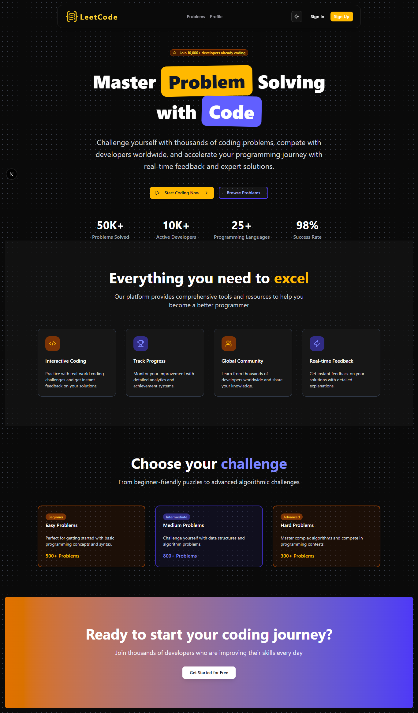
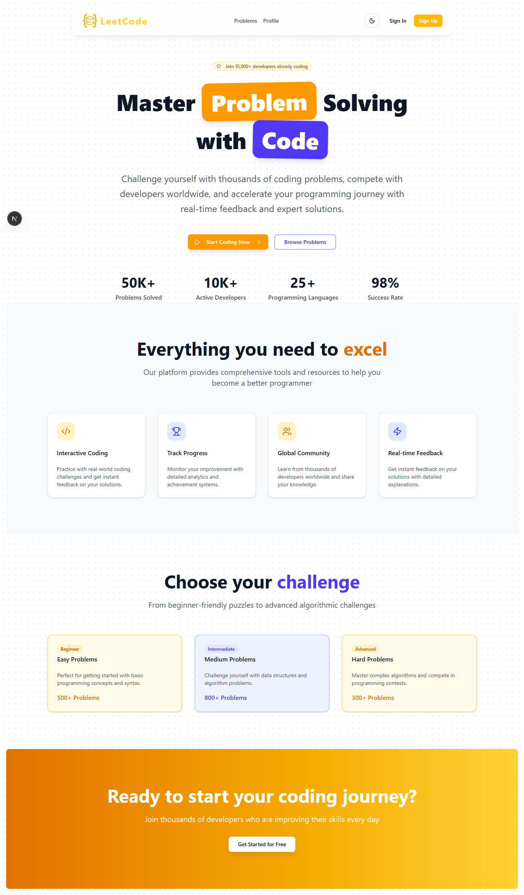
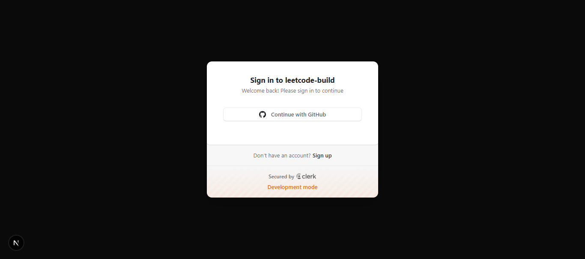
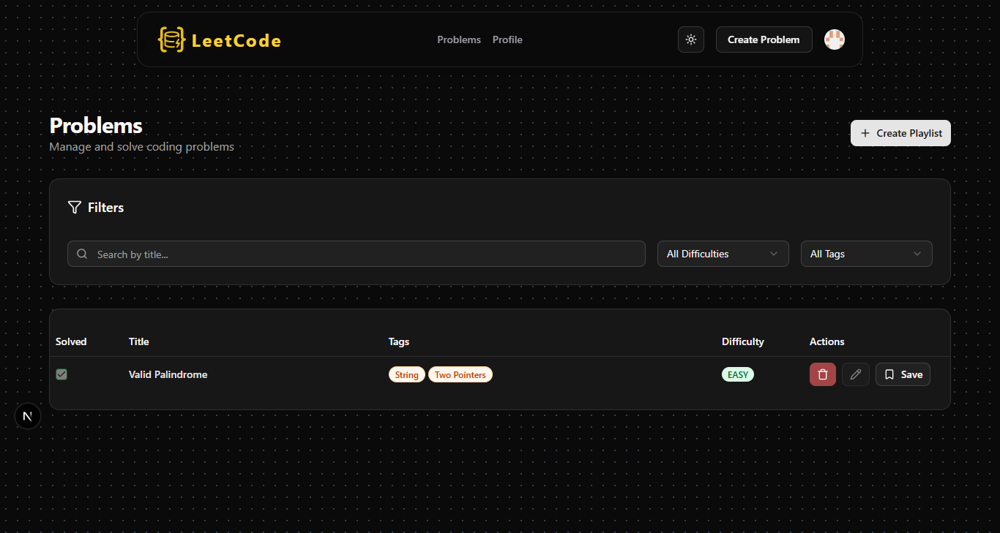
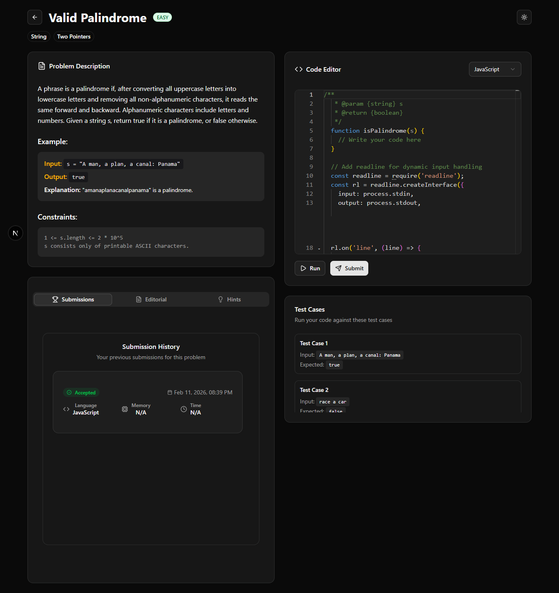
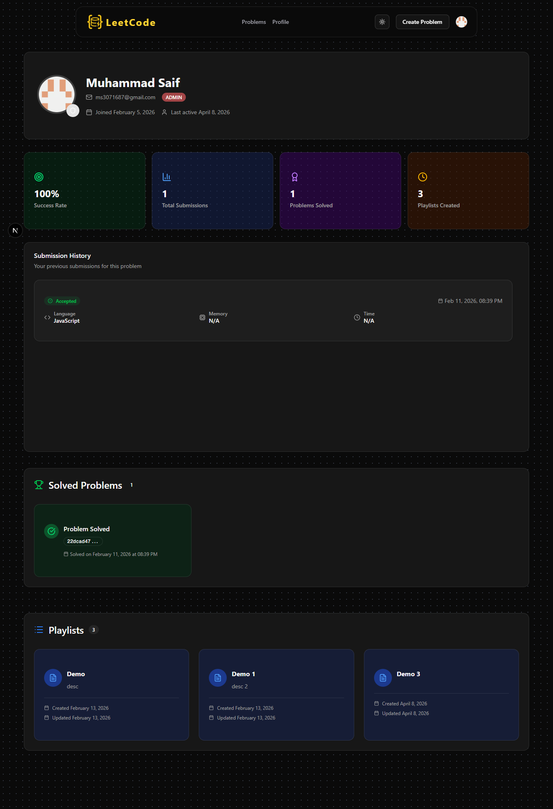
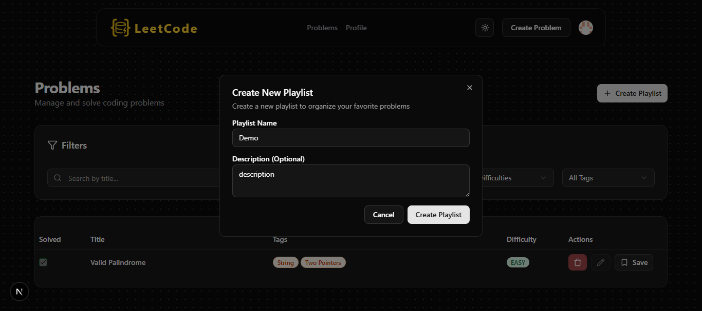
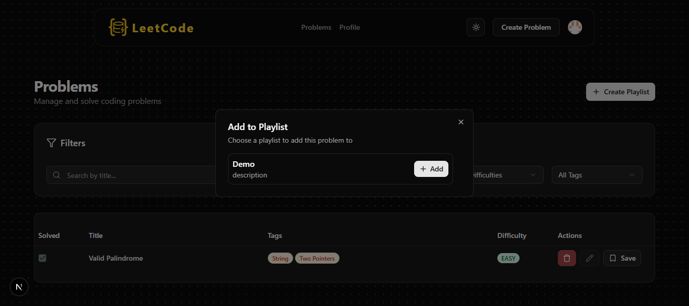
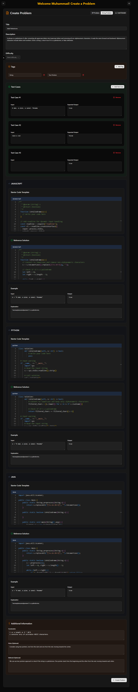

# LeetCode Clone – Full Stack Coding Platform

A production-ready **LeetCode-style coding platform** where users can solve problems, execute code in real-time, and track their progress.

Designed with scalability, clean UI, and developer experience in mind.

---

## Core Features

### Authentication & Authorization

- Secure login via GitHub (Clerk)
- Role-based access:
  - User → Solve problems
  - Admin → Create/Edit/Delete problems

---

### Problem Management

- Create coding problems (Admin only)
- Supports:
  - Title, description, constraints
  - Examples & test cases
- Prebuilt templates (DP, String)

---

### Code Execution Engine

- Real-time code execution using Judge0 API
- Supports multiple languages
- Displays:
  - Output
  - Execution time
  - Memory usage

---

### Submissions & Progress Tracking

- Submission history
- Accepted / Rejected results
- Test case breakdown
- Problem completion status

---

### Playlist System

- Create custom problem playlists
- Save problems for practice
- Organize DSA learning

---

### User Profile Dashboard

- User details (name, email, role)
- Success rate
- Total submissions
- Problems solved
- Playlist overview

---

## Tech Stack

| Layer          | Technology            |
| -------------- | --------------------- |
| Frontend       | Next.js               |
| Auth           | Clerk                 |
| Database       | PostgreSQL            |
| ORM            | Prisma                |
| Code Execution | Judge0                |
| UI             | Tailwind CSS + ShadCN |

---

# How to Use This Platform

## 1. Landing Page

- Visit the homepage
- Toggle between Light/Dark mode

Screenshot:



---

## 2. Sign In

- Click **Sign In**
- Use GitHub authentication

Screenshot:


---

## 3. Browse Problems

- Navigate to **Problems Page**
- View all available problems
- Solved problems show

Screenshot:


---

## 4. Solve a Problem

- Click on any problem
- Read:
  - Description
  - Examples
  - Constraints

Screenshot:


---

## 5. User Profile

- View:
  - Stats
  - Submission history
  - Solved problems

Screenshot:


---

## 6. Create Playlists

- Create custom playlists
- Add problems for practice

Screenshot:



---

## 7. Admin Features (Important)

Only visible if role = admin:

- Create Problem
- Edit Problem
- Delete Problem

## 

# Local Setup Guide

## 1. Clone Repository

```bash
git clone https://github.com/your-username/leetcode-clone.git
cd leetcode-clone
```

## 2. Install Dependencies

```bash
npm install
```

## 3. Setup Environment Variables

```bash
DATABASE_URL=

NEXT_PUBLIC_CLERK_PUBLISHABLE_KEY=
CLERK_SECRET_KEY=

NEXT_PUBLIC_CLERK_SIGN_IN_URL=
NEXT_PUBLIC_CLERK_SIGN_UP_URL=
NEXT_PUBLIC_CLERK_SIGN_IN_FALLBACK_REDIRECT_URL=
NEXT_PUBLIC_CLERK_SIGN_UP_FALLBACK_REDIRECT_URL=

NEXT_PUBLIC_CLERK_SIGN_IN_FORCE_REDIRECT_URL=
NEXT_PUBLIC_CLERK_SIGN_UP_FORCE_REDIRECT_URL=

JUDGE0_API_URL=
```

## 4. Run Development Server

```bash
npm run dev
```

## 5. Run Judge0 (Local)

```bash
docker-compose up -d
```
